## Create a basic shopping cart using React

###### A quick view about how we build this shopping cart

In this post, we explain briefly how we created a shopping cart using React.

**Requirements**

- Node js installed
- Yarn installed
- A terminal

**Get started**
Initially, we created the basic structure of a React app using the following command:
`npx create-react-app plum_cart`
And then, in our project, we installed...
_here webpack, babel, typescript_

**Starting**
As we needed to show products, we started creating the component Card, to show a product, with a title, an image, and a price.
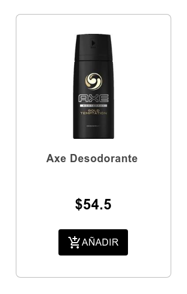
After that, it was necessary to list the products, so we created the components CardList, which uses Card, and ImageList. Here, we decided to use Material-ui for taking advantage of its usable components with a high level design concept. For these components, we used its [GridList](https://material-ui.com/api/grid-list/#gridlist-api) .
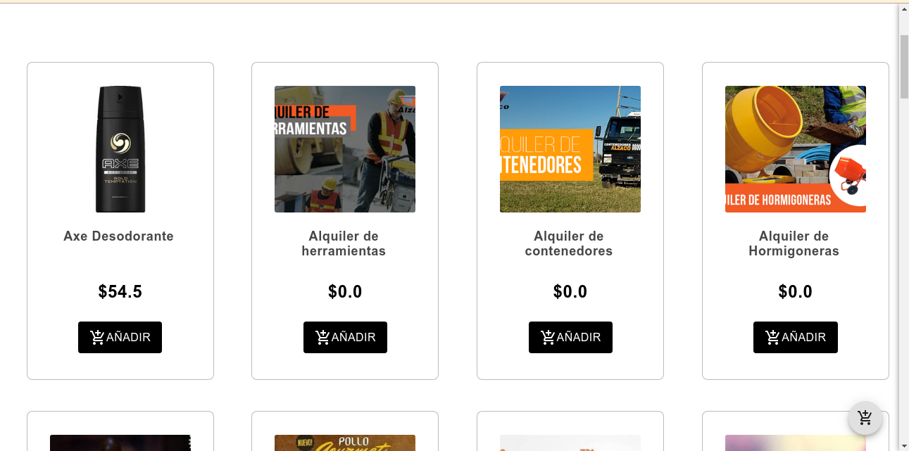

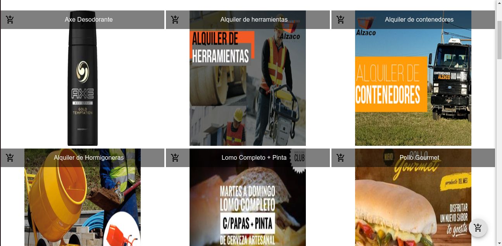
Also, we added a [Switch](https://material-ui.com/api/switch/#switch-api) button that Material provides, to change from a view to another.

**Routing**
To extend our shopping cart, we wanted to create a page for showing a product in a more detailed way, so we created the component Product and installed the [React-router](https://reactrouter.com/web/guides/quick-start) package using:
`yarn add react-router-dom`
to create routes. We modified the App.tsx to manage navigation between the diferents pages, and added a new route "/products/:id", which shows the product with this id.
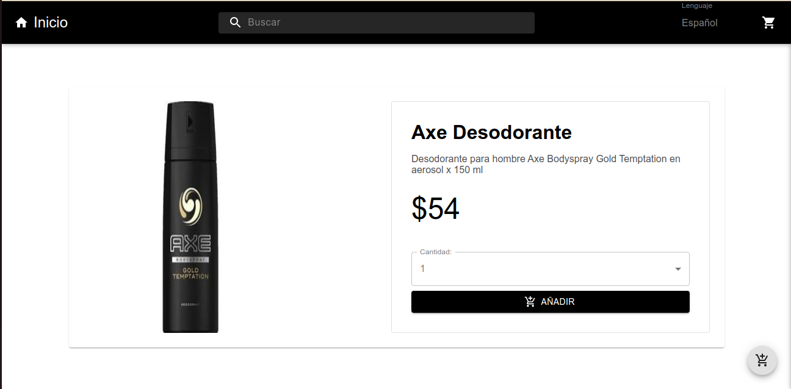
Then, we connected these two pages adding a link in the listed products to the more detail page.

**Adding the cart**
Once the products' view was ready, we could start with one of the most important parts: _the cart_. For this, we added a new route /shoppingcart.
We used Local Storage to save the products that the user adds to the cart, so we had to implement methods for adding and deleting products.
For showing the cart, we created three components, ProductShoppingCart, for displaying a product with the added quantity and the corresponding price, ShoppingCartList, which shows the list of products and the total price, and ShoppingCart, which, in that moment, obtained the products saved in the Local Storage and gave these to ShoppingCartList.
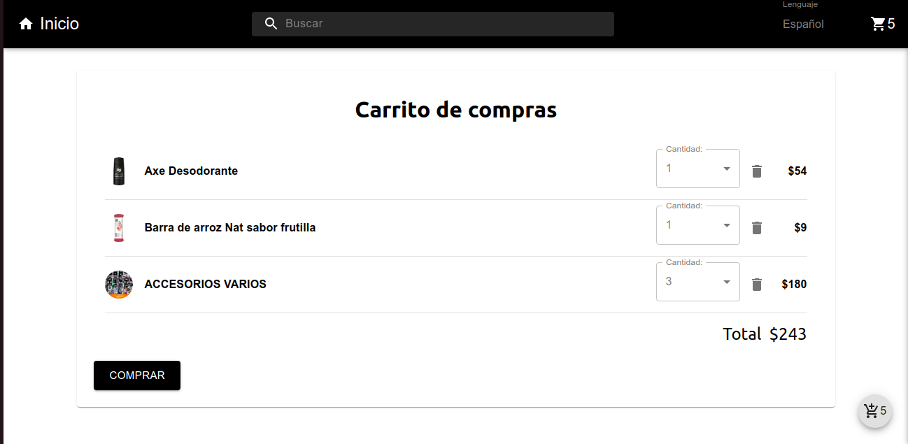
Here, we used buttons from Material-ui to add, delete and show the shopping cart.

**Internationalization and Context**
To make it more interesting we added internationalization using [react-intl](https://formatjs.io/docs/getting-started/installation/) :
`yarn add react-intl`
First, we created a folder "languages" which contains json files (one for each available language) with all the messages that we use. Then, we modified the App.tsx to use this library.
At the beginning, it took the browser's language, so we added a select button to make possible to change it. For this, we had to add a [context](https://es.reactjs.org/docs/context.html) to have access to all the available languages and be able to change the current one.

**Sidebar**
To make a more comfortable view of the cart, we added a sidebar which shows the products using the ShoppingCartList and has a button that redirects to the cart ( /shoppingcart ).
For the effect which opens and closes the sidebar, we created a state to save the current width of the sidebar, and, using a button, it changes between 350 and 0 to show or hide the sidebar.
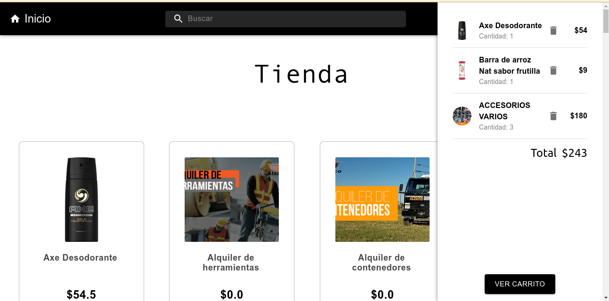
Here, we realized that we were having problems showing changes in the cart, e.g. when a product was added in the cart. So we created a new context for saving the cart's information. That fixed the problem because now this information is just in one place and if it's modify, this will change there.

**UseReducer**
Since our CartContext has methods that make each transition between states complex, we decided change useState for [useReducer](https://es.reactjs.org/docs/hooks-reference.html#usereducer).

**Checkout**
Once our app lets adding products to the cart, it should be possible to buy them, so we incorporated [Mercado Pago](https://www.mercadopago.com.ar/developers/es/guides/online-payments) and a shipping form. We added a button in ShoppingCart which appears when your cart it is not empty. This button redirects to "/shipping" where is the shipping form and a button for paying. This button is disable until the form is completed
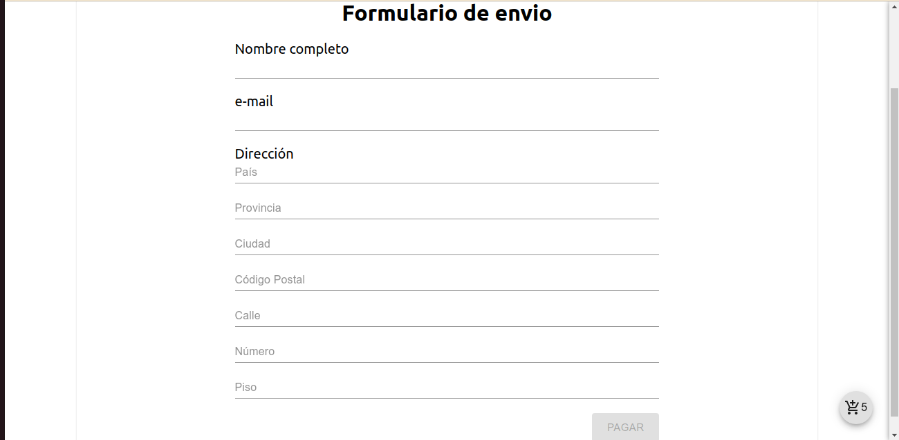
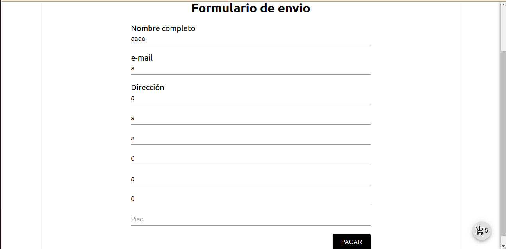 and once you click on it, generates a payment link and redirects you to that one. If the payment was successful, it redirects to "/success" where are shown the products purchased and the cart is cleaned,
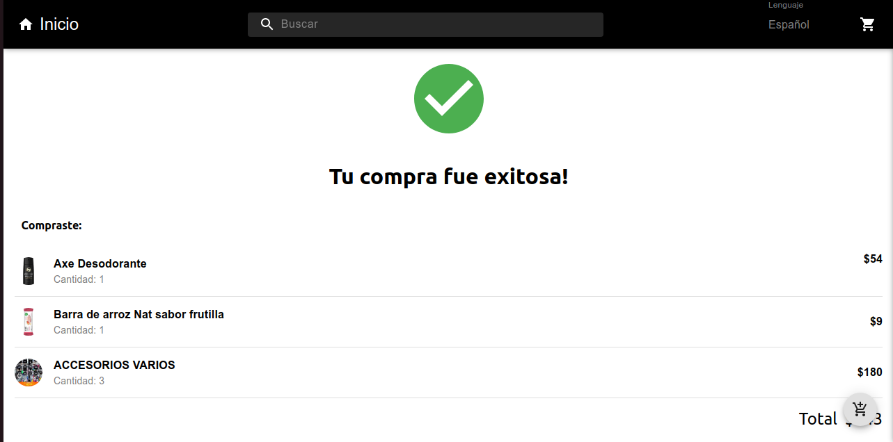
in another case, it redirects to the home page.

**Pagination**
Given that the endpoint we used returns products by page, we needed to implement pagination. First, we created a hook called useOnScreen to know if a div element, is visible or not. If it is visible, we make a request of the next page, and this happens until there are not more products to show.
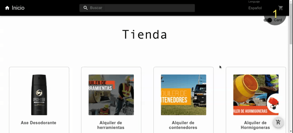

**Search**
And finally, we added a [search bar](https://material-ui.com/es/components/app-bar/#app-bar-with-a-primary-search-field). We used one provided for Material-ui and we added it to the Header. We created the component SearchPage which uses the Main component and the first one gives to the second the product which is looking for.
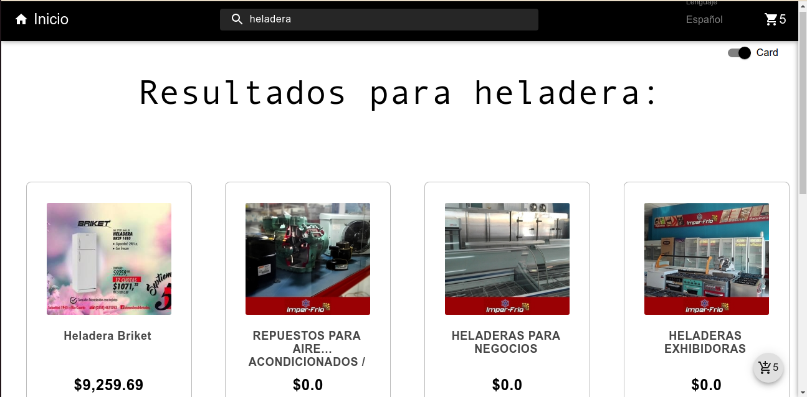
